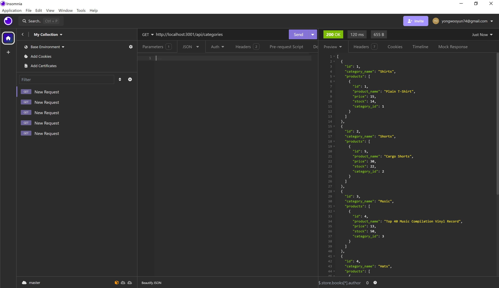
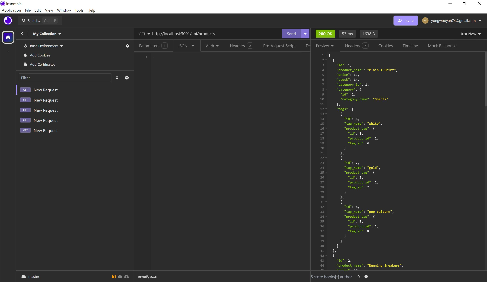
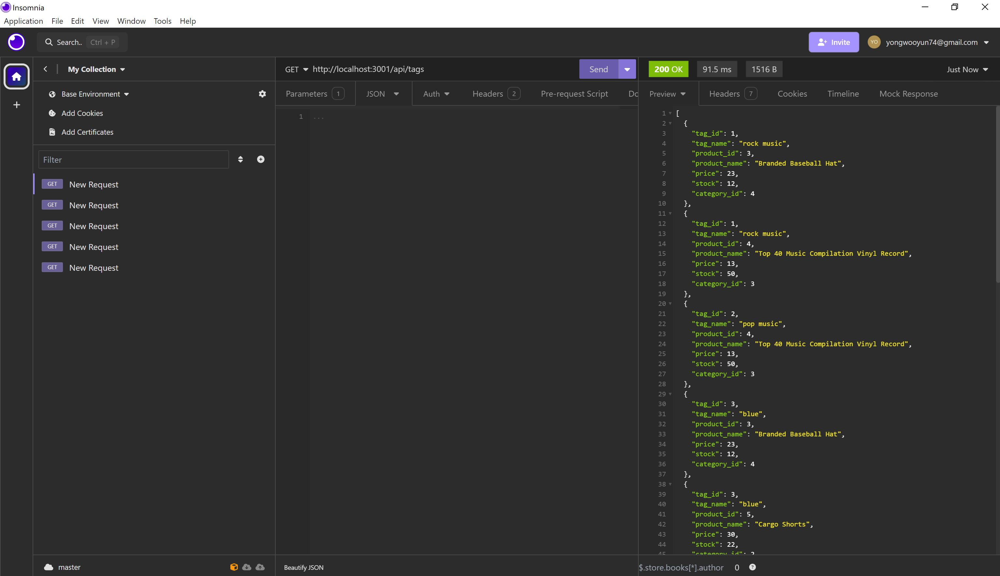

# 13 Object-Relational Mapping (ORM): E-Commerce Back End

All the codes in Develop Folder

GitHub link

https://github.com/sagagi74/ORM_Ecommerce_Back_End

Youtube video Link

## BackGround

Internet retail, also known as **e-commerce**, plays a significant role within the electronics industry, as it empowers businesses and consumers alike to conveniently engage in online buying and selling of electronic products.

This Project is back end for e-commerce website that uses the latest technologies

This project using functional Express.js API and connect to a database, ecommerce_db using Sequelize
After runing schema and seed commands, it creates category, product, product_tag and tag tables with sample data, 
and able to test results using Insomnia example: http://localhost:3001/api/tags (multi table joined result)
you can create, update and delete in Insomnia

### Database Models

* `Category`

  * `id`

    * Integer.
  
    * Doesn't allow null values.
  
    * Set as primary key.
  
    * Uses auto increment.

  * `category_name`
  
    * String.
  
    * Doesn't allow null values.

* `Product`

  * `id`
  
    * Integer.
  
    * Doesn't allow null values.
  
    * Set as primary key.
  
    * Uses auto increment.

  * `product_name`
  
    * String.
  
    * Doesn't allow null values.

  * `price`
  
    * Decimal.
  
    * Doesn't allow null values.
  
    * Validates that the value is a decimal.

  * `stock`
  
    * Integer.
  
    * Doesn't allow null values.
  
    * Set a default value of `10`.
  
    * Validates that the value is numeric.

  * `category_id`
  
    * Integer.
  
    * References the `Category` model's `id`.

* `Tag`

  * `id`
  
    * Integer.
  
    * Doesn't allow null values.
  
    * Set as primary key.
  
    * Uses auto increment.

  * `tag_name`
  
    * String.

* `ProductTag`

  * `id`

    * Integer.

    * Doesn't allow null values.

    * Set as primary key.

    * Uses auto increment.

  * `product_id`

    * Integer.

    * References the `Product` model's `id`.

  * `tag_id`

    * Integer.

    * References the `Tag` model's `id`.

